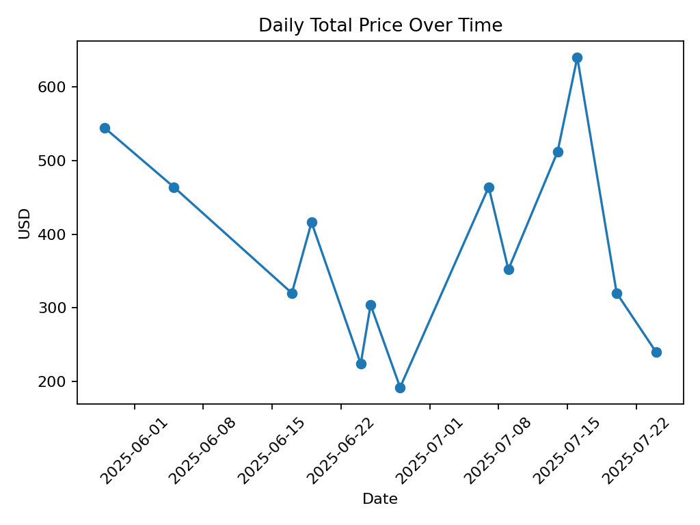

# dunkin-donuts-analysis

This project pulls data from a public Google Sheets CSV, cleans it with Python (pandas), and generates charts with matplotlib.  
A GitHub Actions workflow runs the script on a schedule and commits updated images, so the charts below stay fresh.

## Tech
- Python, pandas, matplotlib
- GitHub Actions (scheduled automation)
- Google Sheets (published as CSV)

## Charts (auto-updated)

